# - Praktikum 11: PHP OOP Lanjutan Dan Praktikum 12: Autentikasi dan Session
# - Pratikum 13 dan 14 Update tambahan Pagination dan Pencarian data
#
# 1. Praktikum 11: PHP OOP Lanjutan
## Mengubah Struktur Project dari Project sebelumnya sesuai contoh yang di berikan
## Contoh Menjadi seperti Struktur ini
```
lab11_php_oop/
├── .htaccess            (Konfigurasi Rewrite URL)
├── config.php           (Konfigurasi Database)
├── index.php            (Routing / Gerbang Utama)
├── assets/              (Css & Gambar pindah ke sini)
│   ├── css/
│   └── gambar/
├── class/               (Library Class)
│   ├── Database.php
│   ├── Form.php
│   └── Auth.php         (Class tambahan)
├── template/            (Layout)
│   ├── header.php
│   └── footer.php
└── module/              (Modul Website)
    ├── home/            (Modul Dashboard)
    │   └── index.php    (File dashboard.php)
    ├── barang/          (Modul Barang)
    │   ├── index.php    (File list.php)
    │   ├── tambah.php   (File add.php)
    │   ├── ubah.php     (File edit.php)
    │   └── hapus.php    (File delete.php)
    └── auth/            (Modul Login)
        ├── login.php
        └── logout.php
```

## Struktur dan yang diubah
## .htaccess
```.htaccess
<IfModule mod_rewrite.c>
RewriteEngine On

RewriteBase /lab11_php_oop/

RewriteCond %{REQUEST_FILENAME} !-d
RewriteCond %{REQUEST_FILENAME} !-f

# Arahkan semua request lain ke index.php
RewriteRule ^(.*)$ index.php/$1 [L]
</IfModule>
```
### [.htaccess](.htaccess)

## config.php
```php
<?php
$config = [
    'host' => 'localhost',
    'username' => 'root',
    'password' => '', 
    'db_name' => 'latihan1' 
];
?>
```
### [config.php](config.php)

### [index.php](index.php)
```php
<?php
session_start();

// Definisi Konstanta (Agar file lama Anda tetap jalan)
define('BASE_PATH', dirname(__FILE__));

define('BASE_URL', 'http://localhost/lab11_php_oop'); 
define('GAMBAR_PATH', BASE_PATH . '/assets/gambar');
define('GAMBAR_URL', BASE_URL . '/assets/gambar');

include "config.php";
include "class/Database.php"; 
include "class/Form.php";     
include "class/Auth.php";    

// Instance Objek Utama
$db = new Database($config);
$auth = new Auth($db);

$path = $_SERVER['PATH_INFO'] ?? '/home/index';
$segments = explode('/', trim($path, '/'));

$mod = $segments[0] ?? 'home';
$page = $segments[1] ?? 'index';
$id = $segments[2] ?? null;

// Cek Login (Kecuali halaman login)
if (!$auth->isLoggedIn() && $mod != 'auth') {
    header("Location: " . BASE_URL . "/auth/login");
    exit;
}

// Tentukan file modul
$file = "module/{$mod}/{$page}.php";

// Load Template & Konten
if ($mod != 'auth') {
    include "template/header.php";
}

if (file_exists($file)) {
    if ($id) $_GET['id'] = $id; 
    include $file;
} else {
    echo '<div class="alert alert-danger">Modul tidak ditemukan: ' . htmlspecialchars($mod . '/' . $page) . '</div>';
}

if ($mod != 'auth') {
    include "template/footer.php";
}
?>
```

## assets
### css
#### [auth.css](assets/css/auth.css)
#### [style.css](assets/css/style.css)
### gambar

## class
### [Database.php](class/Database.php)
```php
<?php
class Database {
    protected $host;
    protected $user;
    protected $password;
    protected $db_name;
    protected $conn;

    // Tambahkan parameter $config ke __construct
    public function __construct($config) { 
        $this->host = $config['host'];
        $this->user = $config['username'];
        $this->password = $config['password'];
        $this->db_name = $config['db_name'];
       
        $this->conn = new mysqli($this->host, $this->user, $this->password, $this->db_name);
        
        if ($this->conn->connect_error) {
            die("Koneksi gagal: " . $this->conn->connect_error);
        }
    }

    public function query($sql) {
        return $this->conn->query($sql);
    }
    
    public function getConnection() {
        return $this->conn;
    }

    public function escape_string($string) {
        return $this->conn->real_escape_string($string);
    }

    public function insert($table, $data) {
        if (is_array($data)) {
            $columns = implode(",", array_keys($data));
            $values = "'" . implode("','", array_values($data)) . "'";
            $sql = "INSERT INTO $table ($columns) VALUES ($values)";
            return $this->conn->query($sql);
        }
        return false;
    }

    public function update($table, $data, $where) {
        if (is_array($data)) {
            $set = "";
            foreach ($data as $key => $value) {
                $set .= "$key='$value', ";
            }
            $set = rtrim($set, ", ");
            $sql = "UPDATE $table SET $set WHERE $where";
            return $this->conn->query($sql);
        }
        return false;
    }

    public function delete($table, $where) {
        $sql = "DELETE FROM $table WHERE $where";
        return $this->conn->query($sql);
    }

    public function getAll($table, $where = null, $order = null) {
        $sql = "SELECT * FROM $table";
        if ($where) $sql .= " WHERE $where";
        if ($order) $sql .= " ORDER BY $order";
        $result = $this->conn->query($sql);
        if ($result && $result->num_rows > 0) return $result->fetch_all(MYSQLI_ASSOC);
        return [];
    }
    
    public function get($table, $where = null) {
        $sql = "SELECT * FROM $table";
        if ($where) $sql .= " WHERE $where";
        $result = $this->conn->query($sql);
        if ($result && $result->num_rows > 0) return $result->fetch_assoc();
        return false;
    }
}
?>
```
### [Form.php](class/Form.php)
### [Auth.php](class/Auth.php)

## template
### [header.php](template/header.php)
### [footer.php](template/footer.php)

## module
### home
#### [index.php](module/home/index.php)

### barang
#### [index.php](module/barang/index.php)
#### [tambah.php](module/barang/tambah.php)
#### [ubah.php](module/barang/ubah.php)
#### [hapus.php](module/barang/hapus.php)

### auth
#### [login.php](module/auth/login.php)
#### [logout.php](module/auth/logout.php)

## Tampilan Halaman Tetap sama (http://localhost/lab11_php_oop/home/index)

.png>)

#
# 2. Praktikum 12: Autentikasi dan Session
## File sebelunya sudah ada system login, dan sekarang hanya memodifikasi agar sesuai dengan arahan yang di berikan di PDF Pratikum 12.
# F. Tugas Praktikum 
### 1. Tambahkan fitur "Profil". Buat halaman di module/user/profile.php yang menampilkan data user yang sedang login (Nama, Username) dan form untuk mengubah Password. 
### 2. Implementasikan logika enkripsi password (password_hash) saat mengubah password di fitur profil tersebut.
## Modify Class Auth.php agar sesuai
### Sebelummnya:
```php
<?php
/**
 * Class Auth
 * Deskripsi: Class untuk handling authentication
 */
class Auth {
    private $db;

    public function __construct($database) {
        $this->db = $database;
    }

    public function login($username, $password) {
        $username = $this->db->escape_string($username);
        $password = $this->db->escape_string($password);
        
        $sql = "SELECT * FROM users WHERE username='$username' AND password='$password'";
        $result = $this->db->query($sql);
        
        if ($result && $result->num_rows === 1) {
            $_SESSION['username'] = $username;
            $_SESSION['login_time'] = time();
            return true;
        }
        return false;
    }

    public function isLoggedIn() {
        return isset($_SESSION['username']);
    }

    public function logout() {
        session_destroy();
        header("Location: " . BASE_URL . "/auth/login");
        exit;
    }

    public function getUser() {
        return $_SESSION['username'] ?? null;
    }

    public function checkAccess() {
        if (!$this->isLoggedIn()) {
            header("Location: " . BASE_URL . "/auth/login");
            exit;
        }
    }
}
?>
```
### Sesudah modify:
```php
<?php
/**
 * Class Auth
 * Deskripsi: Class untuk handling authentication menggunakan password_hash.
 */
class Auth {
    private $db;

    public function __construct($database) {
        $this->db = $database;
    }

    public function login($username, $password) {
        $username = $this->db->escape_string($username);
       
        // Kita perlu kolom 'password' (hash) dan 'nama'
        $sql = "SELECT username, password, nama FROM users WHERE username='$username'";
        $result = $this->db->query($sql);
        
        if ($result && $result->num_rows === 1) {
            $user = $result->fetch_assoc();
            
            // Verifikasi password (plaintext) dengan hash di database
            if (password_verify($password, $user['password'])) {
  
                $_SESSION['username'] = $user['username'];
                $_SESSION['nama'] = $user['nama']; 
                $_SESSION['login_time'] = time();
                return true;
            }
        }
 
        return false;
    }

    public function isLoggedIn() {
        return isset($_SESSION['username']);
    }

    public function logout() {
        session_destroy();
        $_SESSION = array(); 
        header("Location: " . BASE_URL . "/auth/login");
        exit;
    }

    public function getUser() {
        return $_SESSION['username'] ?? null;
    }
    
    public function getUserName() {
        return $_SESSION['nama'] ?? null;
    }

    // --- Metode Baru untuk Profil ---
    public function getUserData() {
        if (!$this->isLoggedIn()) {
            return false;
        }
        $username = $this->db->escape_string($_SESSION['username']);
        return $this->db->get('users', "username = '$username'");
    }

    public function updatePassword($username, $new_password) {
        $hashed_password = password_hash($new_password, PASSWORD_DEFAULT);
        
        $data = ['password' => $hashed_password];
        $username = $this->db->escape_string($username);
        $where = "username = '$username'";
        
        return $this->db->update('users', $data, $where);
    }
 
    public function checkAccess() {
        if (!$this->isLoggedIn()) {
            header("Location: " . BASE_URL . "/auth/login");
            exit;
        }
    }
}
?>
```
#
## Tambahan Halaman Profil sesuai arahan dari tugas di PDF Pratikum 12
### Buat file baru di lokasi yang sesuai dengan struktur URL: module/user/profile.php.
### File: (module/user/profile.php) [profile.php](module/user/profile.php)
```php
<?php
// module/user/profile.php
$db = $GLOBALS['db'];
$auth = $GLOBALS['auth'];
$auth->checkAccess();

$error = null;
$message = null;
$userData = $auth->getUserData();

if (!$userData) {
    header('Location: ' . BASE_URL . '/auth/login');
    exit;
}

if ($_SERVER['REQUEST_METHOD'] === 'POST') {
    $current_password = $_POST['current_password'] ?? '';
    $new_password = $_POST['new_password'] ?? '';
    $confirm_password = $_POST['confirm_password'] ?? '';

    // 1. Validasi Input
    if (empty($current_password) || empty($new_password) || empty($confirm_password)) {
        $error = "Semua field password harus diisi.";
    } elseif ($new_password !== $confirm_password) {
        $error = "Password baru dan konfirmasi password tidak cocok.";
    } elseif (strlen($new_password) < 6) {
        $error = "Password baru minimal 6 karakter.";
    } else {
        // 2. Verifikasi Password Lama
        if (!password_verify($current_password, $userData['password'])) {
            $error = "Password lama salah.";
        } else {
            // 3. Update Password Baru (Menggunakan fungsi updatePassword yang sudah mengimplementasikan password_hash)
            if ($auth->updatePassword($userData['username'], $new_password)) {
                $message = "Password berhasil diubah!";
                $userData = $auth->getUserData(); 
            } else {
                $error = "Gagal mengubah password: " . $db->getConnection()->error;
            }
        }
    }
}
?>

<div class="page-header">
    <div class="header-title">
        <h2><i class="fas fa-user-circle"></i> Profil Pengguna</h2>
        <p>Lihat data profil dan ubah password Anda</p>
    </div>
</div>

<div class="dashboard-content profile-layout">
    <div class="card profile-card">
        <div class="card-header">
            <h3><i class="fas fa-id-badge"></i> Data Akun</h3>
        </div>
        <div class="card-body">
            <p><strong>Nama:</strong> <?php echo htmlspecialchars($userData['nama']); ?></p>
            <p><strong>Username:</strong> <?php echo htmlspecialchars($userData['username']); ?></p>
        </div>
    </div>

    <div class="card password-card">
        <div class="card-header">
            <h3><i class="fas fa-key"></i> Ubah Password</h3>
        </div>
        <div class="card-body">
            <?php if (isset($error)): ?>
                <div class="alert alert-danger">
                    <i class="fas fa-exclamation-triangle"></i>
                    <?php echo $error; ?>
                </div>
            <?php endif; ?>

            <?php if (isset($message)): ?>
                <div class="alert alert-success">
                    <i class="fas fa-check-circle"></i>
                    <?php echo $message; ?>
                </div>
            <?php endif; ?>

            <?php
            // Buat form untuk mengubah password
            $form = new Form('', 'Ubah Password', 'POST');
            $form->addField('current_password', 'Password Lama', 'password', '');
            $form->addField('new_password', 'Password Baru', 'password', '');
            $form->addField('confirm_password', 'Konfirmasi Password Baru', 'password', '');
            $form->setResetButton(false);
            $form->render();
            ?>
        </div>
    </div>
</div>
```
## Lalu tambahkan bagian profile di header.php
```html
                <nav class="main-nav">
                    <a href="<?php echo BASE_URL; ?>/home/index" class="nav-link <?php echo $module === 'dashboard' ? 'active' : ''; ?>">
                        <i class="fas fa-tachometer-alt"></i>
                        <span>Dashboard</span>
                    </a>
                    <a href="<?php echo BASE_URL; ?>/barang/index" class="nav-link <?php echo $module === 'barang' ? 'active' : ''; ?>">
                        <i class="fas fa-list"></i>
                        <span>Data Barang</span>
                    </a>
                    <a href="<?php echo BASE_URL; ?>/barang/tambah" class="nav-link">
                        <i class="fas fa-plus"></i>
                        <span>Tambah Barang</span>
                    </a>
                    <li class="nav-item">
                        <a class="nav-link" href="<?php echo BASE_URL; ?>/user/profile">        <!-- Di bagian sini di bawah tambah barang -->
                            <i class="fas fa-user-circle"></i> Profil
                        </a>
                    </li>
                    <a href="<?php echo BASE_URL; ?>/auth/logout" class="nav-link logout-btn">
                        <i class="fas fa-sign-out-alt"></i>                                             <!-- dan bagian logout ganti menjadi ini untuk menampilkan user -->
                        <span>(<?php echo htmlspecialchars($_SESSION['nama'] ?? 'User'); ?>)</span>
                    </a>
                </nav>
```
## Lalu menyesuaikan form agar sesuai dengan profile
### Sebelumnya:
```php
<?php
/**
 * Class Form
 * Deskripsi: Class untuk membuat form inputan
 */
class Form {
    private $fields = array();
    private $action;
    private $method = "POST";
    private $submit = "Submit Form";
    private $enctype = "";
    private $resetButton = true;

    public function __construct($action = "", $submit = "Submit", $method = "POST", $enctype = "") {
        $this->action = $action;
        $this->submit = $submit;
        $this->method = $method;
        $this->enctype = $enctype;
    }

    public function addField($name, $label, $type = "text", $value = "", $options = array()) {
        $this->fields[] = array(
            'name' => $name,
            'label' => $label,
            'type' => $type,
            'value' => $value,
            'options' => $options
        );
    }

    public function setResetButton($show) {
        $this->resetButton = $show;
    }

    public function render() {
        $enctypeAttr = $this->enctype ? " enctype='{$this->enctype}'" : "";
        echo "<form action='{$this->action}' method='{$this->method}'{$enctypeAttr} class='form'>";
        echo '<div class="form-grid">';
        
        foreach ($this->fields as $field) {
            $this->renderField($field);
        }
        
        echo '</div>';
        echo '<div class="form-actions">';
        
        if ($this->resetButton) {
            echo "<button type='reset' class='btn btn-secondary'><i class='fas fa-redo'></i> Reset</button>";
        }
        
        echo "<button type='submit' class='btn btn-primary'><i class='fas fa-save'></i> {$this->submit}</button>";
        echo '</div>';
        echo '</form>';
    }

    private function renderField($field) {
        echo '<div class="form-group">';
        echo "<label for='{$field['name']}' class='form-label'>";
        
        // Add icon based on field type
        $icon = $this->getIcon($field['name']);
        if ($icon) {
            echo "<i class='fas fa-{$icon}'></i>";
        }
        
        echo "{$field['label']}</label>";
        
        switch ($field['type']) {
            case 'select':
                echo "<select id='{$field['name']}' name='{$field['name']}' class='form-control' required>";
                echo "<option value=''>Pilih {$field['label']}</option>";
                foreach ($field['options'] as $key => $value) {
                    $selected = ($key == $field['value']) ? "selected" : "";
                    echo "<option value='{$key}' {$selected}>{$value}</option>";
                }
                echo "</select>";
                break;
                
            case 'file':
                echo "<input type='file' id='{$field['name']}' name='{$field['name']}' class='form-control' accept='image/*'>";
                if (isset($field['options']['current'])) {
                    if ($field['options']['current']) {
                        // Tampilkan gambar preview jika ada
                        echo "<div class='current-image-preview'>";
                        echo "<small class='form-text'>Gambar saat ini:</small><br>";
                        echo "";
                        echo "</div>";
                    } else {
                        echo "<small class='form-text'>Belum ada gambar</small>";
                    }
                }
                break;
                
            case 'number':
                $min = isset($field['options']['min']) ? "min='{$field['options']['min']}'" : "";
                $step = isset($field['options']['step']) ? "step='{$field['options']['step']}'" : "";
                echo "<input type='number' id='{$field['name']}' name='{$field['name']}' class='form-control' value='{$field['value']}' required {$min} {$step}>";
                break;
                
            case 'password':
                echo "<input type='password' id='{$field['name']}' name='{$field['name']}' class='form-control' value='{$field['value']}' required>";
                break;
                
            default:
                echo "<input type='{$field['type']}' id='{$field['name']}' name='{$field['name']}' class='form-control' value='{$field['value']}' required>";
                break;
        }
        
        echo '</div>';
    }
    
    private function getIcon($fieldName) {
        $icons = [
            'nama' => 'tag',
            'kategori' => 'layer-group',
            'harga_beli' => 'shopping-cart',
            'harga_jual' => 'tags',
            'stok' => 'boxes',
            'file_gambar' => 'image',
            'username' => 'user',
            'password' => 'lock'
        ];
        
        return isset($icons[$fieldName]) ? $icons[$fieldName] : 'edit';
    }
}
?>
```
### Sesudah modify
```php
<?php
/**
 * Class Form
 * Deskripsi: Class untuk membuat form inputan
 */
class Form {
    private $fields = array();
    private $action;
    private $method = "POST";
    private $submit = "Submit Form";
    private $enctype = "";
    private $resetButton = true;

    public function __construct($action = "", $submit = "Submit", $method = "POST", $enctype = "") {
        $this->action = $action;
        $this->submit = $submit;
        $this->method = $method;
        $this->enctype = $enctype;
    }

    public function addField($name, $label, $type = "text", $value = "", $options = array()) {
        $this->fields[] = array(
            'name' => $name,
            'label' => $label,
            'type' => $type,
            'value' => $value,
            'options' => $options
        );
    }

    public function setResetButton($show) {
        $this->resetButton = $show;
    }

    public function render() {
        $enctypeAttr = $this->enctype ? " enctype='{$this->enctype}'" : "";
        echo "<form action='{$this->action}' method='{$this->method}'{$enctypeAttr} class='form'>";
        echo '<div class="form-grid">';
        
        foreach ($this->fields as $field) {
            $this->renderField($field);
        }
        
        echo '</div>';
        echo '<div class="form-actions">';
        
        if ($this->resetButton) {
            echo "<button type='reset' class='btn btn-secondary'><i class='fas fa-redo'></i> Reset</button>";
        }
        
        echo "<button type='submit' class='btn btn-primary'><i class='fas fa-save'></i> {$this->submit}</button>";
        echo '</div>';
        echo '</form>';
    }

    private function renderField($field) {
        // Ambil nilai field (digunakan untuk text, number, select)
        $fieldValue = htmlspecialchars($field['value'] ?? '');
        
        // Default: required. Bisa dihilangkan dengan menyetel ['options']['required'] = false.
        $isRequired = (isset($field['options']['required']) && $field['options']['required'] === false) ? false : true;
        $requiredAttr = $isRequired ? 'required' : '';

        echo '<div class="form-group">';
        echo "<label for='{$field['name']}' class='form-label'>";
        
        // Add icon based on field type
        $icon = $this->getIcon($field['name']);
        if ($icon) {
            echo "<i class='fas fa-{$icon}'></i>";
        }
        
        echo "{$field['label']}</label>";
        
        switch ($field['type']) {
            case 'select':
                echo "<select id='{$field['name']}' name='{$field['name']}' class='form-control' {$requiredAttr}>";
                echo "<option value=''>Pilih {$field['label']}</option>";
                foreach ($field['options'] as $key => $value) {
                    $selected = ($key == $field['value']) ? "selected" : "";
                    echo "<option value='{$key}' {$selected}>{$value}</option>";
                }
                echo "</select>";
                break;
                
            case 'file':
                echo "<input type='file' id='{$field['name']}' name='{$field['name']}' class='form-control' accept='image/*' {$requiredAttr}>";
                if (isset($field['options']['current'])) {
                    if ($field['options']['current']) {
                        // Tampilkan gambar preview jika ada
                        echo "<div class='current-image-preview'>";
                        echo "<small class='form-text'>Gambar saat ini:</small><br>";
                        echo "";
                        echo "</div>";
                    } else {
                        echo "<small class='form-text'>Belum ada gambar</small>";
                    }
                }
                break;
                
            case 'number':
                $min = isset($field['options']['min']) ? "min='{$field['options']['min']}'" : "";
                $step = isset($field['options']['step']) ? "step='{$field['options']['step']}'" : "";
                echo "<input type='number' id='{$field['name']}' name='{$field['name']}' class='form-control' value='{$fieldValue}' {$requiredAttr} {$min} {$step}>";
                break;
                
            case 'password':
                echo "<input type='password' id='{$field['name']}' name='{$field['name']}' class='form-control' value='' {$requiredAttr}>";
                break;
                
            default:
                echo "<input type='{$field['type']}' id='{$field['name']}' name='{$field['name']}' class='form-control' value='{$fieldValue}' {$requiredAttr}>";
                break;
        }
        
        echo '</div>';
    }
    
    private function getIcon($fieldName) {
        $icons = [
            'nama' => 'tag',
            'kategori' => 'layer-group',
            'harga_beli' => 'shopping-cart',
            'harga_jual' => 'tags',
            'stok' => 'boxes',
            'file_gambar' => 'image',
            'username' => 'user',
            'password' => 'lock'
        ];
        
        return isset($icons[$fieldName]) ? $icons[$fieldName] : 'edit';
    }
}
?>
```
## Lalu mengganti tabel SQL user sebelummnya dengan
```sql
CREATE TABLE users ( 
id INT AUTO_INCREMENT PRIMARY KEY, 
username VARCHAR(50) NOT NULL, 
password VARCHAR(255) NOT NULL, 
nama VARCHAR(100) 
);
```
## Dengan user dummy, buat user dengan password "admin123". 
```sql
-- Password hash dari "admin123" 
INSERT INTO users (username, password, nama)  
VALUES ('admin', '$2y$10$uWdZ2x.hQfGqGz/..q7wue.3/a/e/e/e/e/e/e/e/e/e/e', 
'Administrator');
```
### Ubah bagian password hash ('$2y$10$uWdZ2x.hQfGqGz/..q7wue.3/a/e/e/e/e/e/e/e/e/e/e') dengan generate hash "admin123" di [https://bcrypt.online/]
#### Contoh
```php
INSERT INTO users (username, password, nama)  
VALUES ('admin', '$2y$10$3mrGAyI5PCQhIl7cVWObgOm6s/q9W8wdvKAJUcT0qEmb6xF/IN2KO', 
'Administrator');
```

## E. Langkah Uji Coba 
## 1. Akses Halaman Artikel (Tanpa Login): Buka browser: http://localhost/lab11_php_oop/artikel/index. 
- Hasil: Kamu seharusnya otomatis terlempar (redirect) ke halaman user/login. 
## Percobaan:

  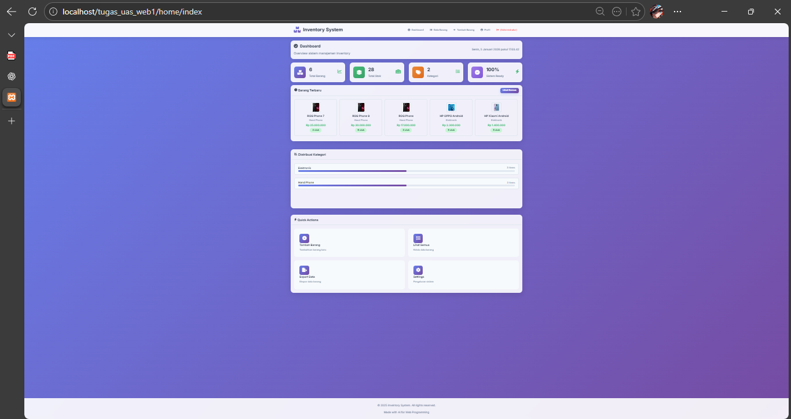

## 2. Lakukan Login: 
- Masukkan username: admin dan password: admin123. 
- Hasil: Jika sukses, kamu akan diarahkan ke halaman artikel, dan di pojok kanan atas muncul menu "Logout (Administrator)".
## Percobaan:
- Halaman setelah login

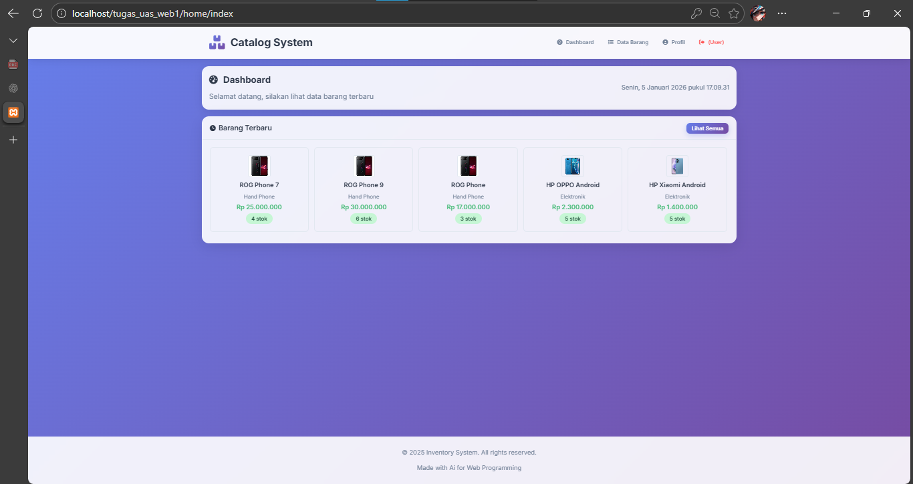   

- Menampilkan (Administrator) atau logout di pojok atas

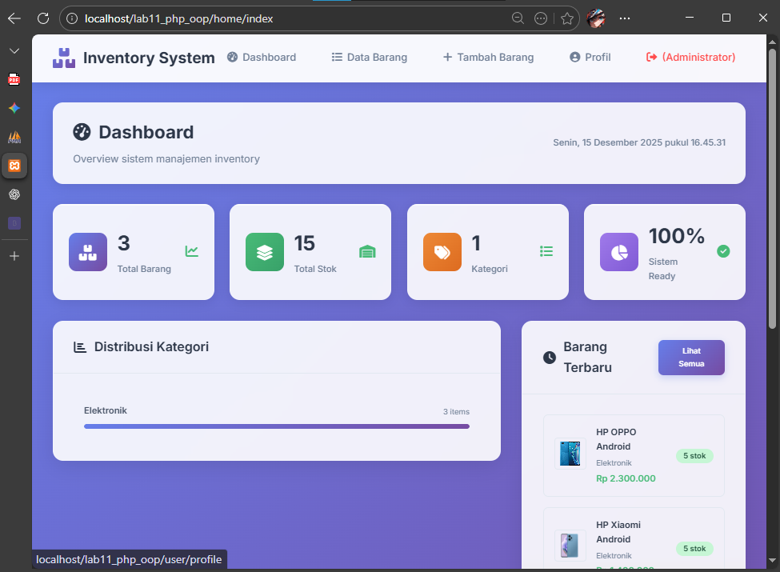

## 3. Akses CRUD: 
- Coba tambah, edit, atau hapus data. Semua harus berjalan normal. 
## Percobaan:
- Tambah barang

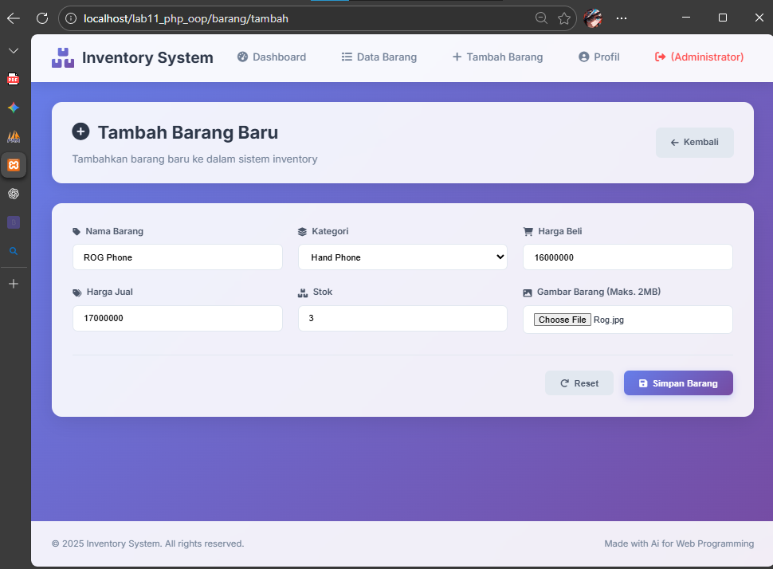

- Edit barang

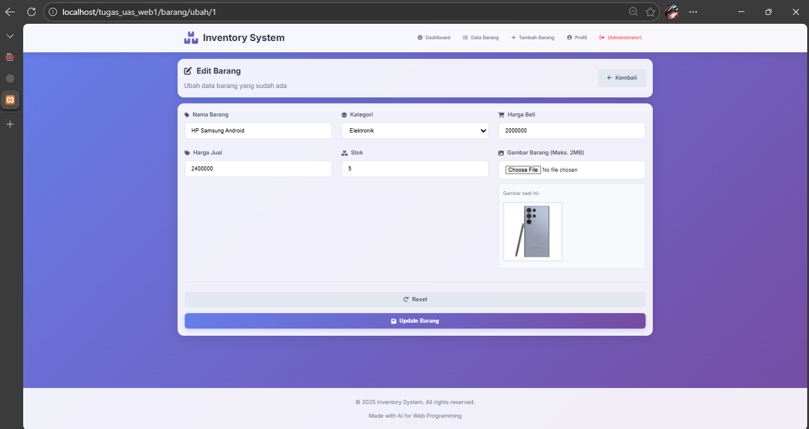

- Hapus data barang

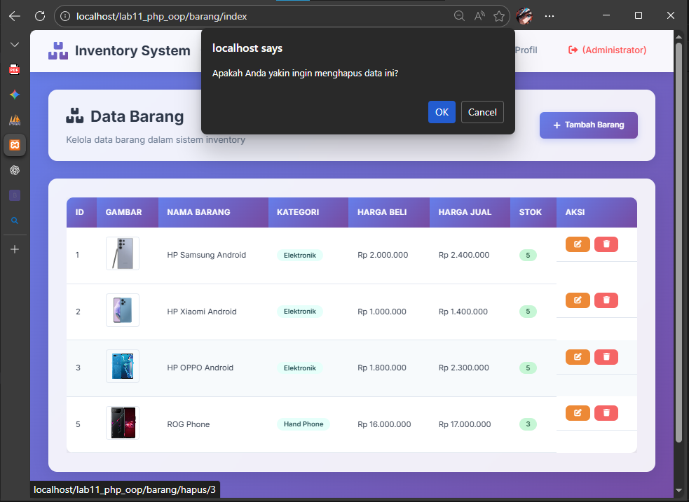

## 4. Logout: 
- Klik menu Logout. Kamu akan kembali ke halaman login. 
## Percobaan:
- Setelah klik Logout (administrator) akan kembali ke login

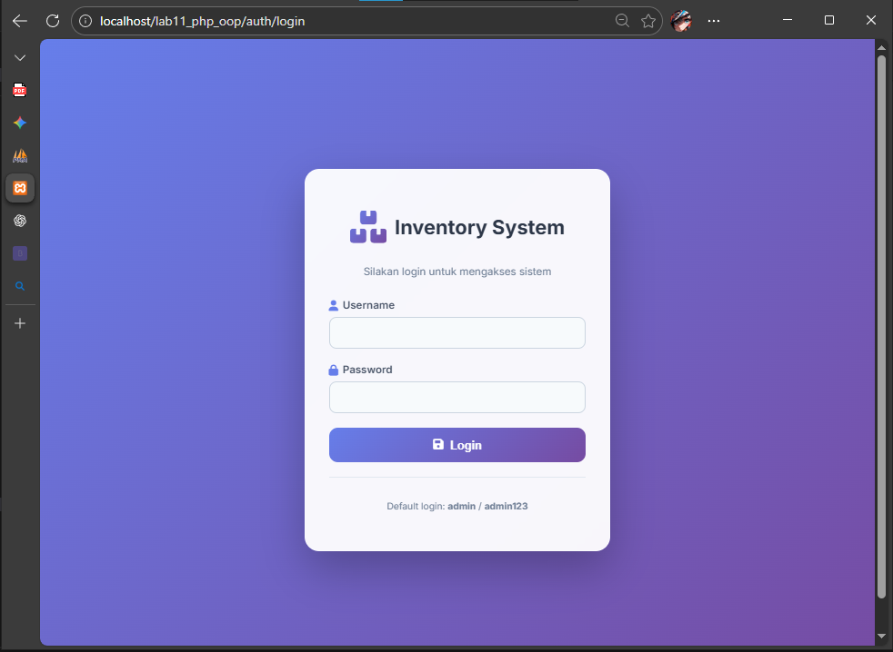

## Dan tampilan Profile sederhana, hanya menampilkan nama dan ubah password

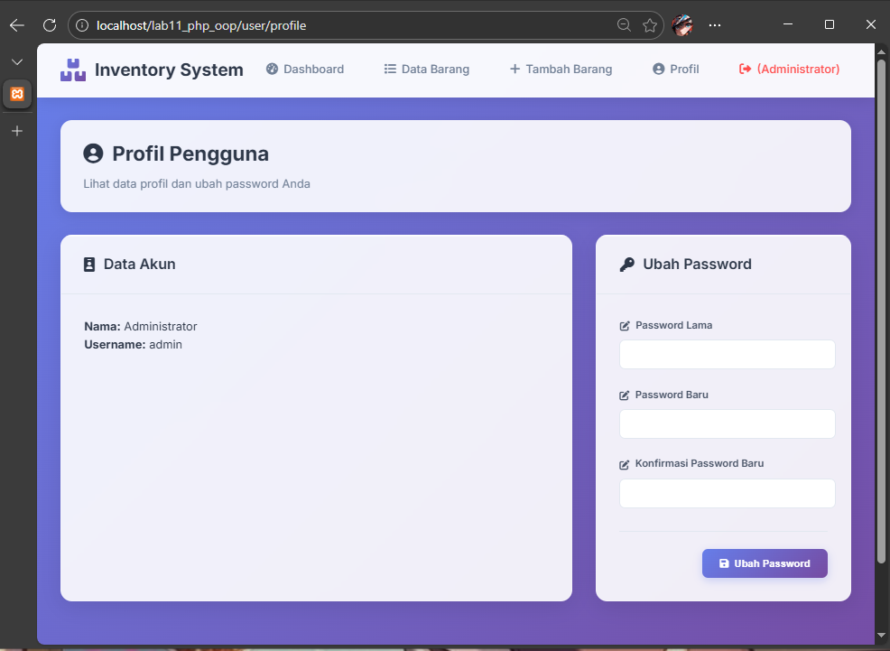

#
# 3. Pratikum 13 dan 14 Tambahkan Pagination dan search/pencarian barang
# Di tambahkan dibagian index atau list barang
## Ganti bagian index/list barang
## Sebelumnya
### Tampilannya

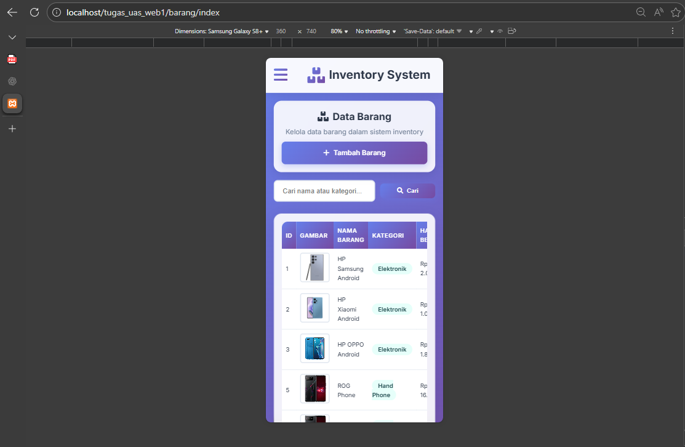

```php
<?php
$db = $GLOBALS['db'];

// Query untuk mengambil data barang menggunakan Database class
$barang_list = $db->getAll('data_barang', null, 'id_barang ASC');
?>

<div class="page-header">
    <div class="header-title">
        <h2><i class="fas fa-boxes"></i> Data Barang</h2>
        <p>Kelola data barang dalam sistem inventory</p>
    </div>
    <a href="<?php echo BASE_URL; ?>/barang/tambah" class="btn btn-primary">
        <i class="fas fa-plus"></i>
        Tambah Barang
    </a>
</div>

<div class="card">
    <div class="card-body">
        <?php if (count($barang_list) > 0): ?>
            <div class="table-responsive">
                <table class="data-table">
                    <thead>
                        <tr>
                            <th>ID</th>
                            <th>Gambar</th>
                            <th>Nama Barang</th>
                            <th>Kategori</th>
                            <th>Harga Beli</th>
                            <th>Harga Jual</th>
                            <th>Stok</th>
                            <th>Aksi</th>
                        </tr>
                    </thead>
                    <tbody>
                        <?php foreach ($barang_list as $row): ?>
                            <tr>
                                <td><?php echo $row['id_barang']; ?></td>
                                <td class="product-image">
                                    <?php 
                                    $imagePath = GAMBAR_PATH . '/' . $row['gambar'];
                                    $imageUrl = $row['gambar'] ? GAMBAR_URL . '/' . $row['gambar'] : '';
                                    
                                    if (!empty($row['gambar']) && file_exists($imagePath)): 
                                    ?>
                                        " 
                                             alt="<?php echo htmlspecialchars($row['nama']); ?>" 
                                             style="width: 60px; height: 60px; object-fit: cover; border-radius: 5px;">
                                    <?php else: ?>
                                        <div class="no-image" style="width: 60px; height: 60px; background: #f7fafc; border: 2px dashed #cbd5e0; border-radius: 5px; display: flex; align-items: center; justify-content: center; color: #a0aec0;">
                                            <i class="fas fa-image"></i>
                                        </div>
                                    <?php endif; ?>
                                </td>
                                <td class="product-name"><?php echo htmlspecialchars($row['nama']); ?></td>
                                <td class="product-category">
                                    <span class="category-badge"><?php echo htmlspecialchars($row['kategori']); ?></span>
                                </td>
                                <td class="product-price">Rp <?php echo number_format($row['harga_beli'], 0, ',', '.'); ?></td>
                                <td class="product-price">Rp <?php echo number_format($row['harga_jual'], 0, ',', '.'); ?></td>
                                <td class="product-stock">
                                    <span class="stock-badge <?php echo $row['stok'] > 0 ? 'in-stock' : 'out-of-stock'; ?>">
                                        <?php echo $row['stok']; ?>
                                    </span>
                                </td>
                                <td class="action-buttons">
                                    <a href="<?php echo BASE_URL; ?>/barang/ubah/<?php echo $row['id_barang']; ?>" 
                                       class="btn btn-sm btn-warning" title="Edit">
                                        <i class="fas fa-edit"></i>
                                    </a>
                                    <a href="<?php echo BASE_URL; ?>/barang/hapus/<?php echo $row['id_barang']; ?>"
                                       class="btn btn-sm btn-danger" 
                                       onclick="return confirmDelete()" title="Hapus">
                                        <i class="fas fa-trash"></i>
                                    </a>
                                </td>
                            </tr>
                        <?php endforeach; ?>
                    </tbody>
                </table>
            </div>
        <?php else: ?>
            <div class="empty-state">
                <i class="fas fa-box-open"></i>
                <h3>Belum ada data barang</h3>
                <p>Silakan tambah barang baru untuk memulai</p>
                <a href="<?php echo BASE_URL; ?>/barang/tambah" class="btn btn-primary">
                    <i class="fas fa-plus"></i>
                    Tambah Barang Pertama
                </a>
            </div>
        <?php endif; ?>
    </div>
</div>
```
## Setelah di ganti
### Tampilannya

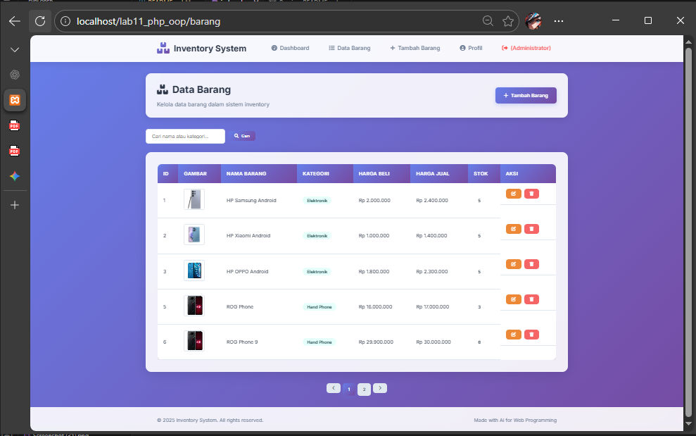

```php
<?php
$db = $GLOBALS['db'];

// LOGIKA SEARCH & PAGINATION
$q = "";
$whereSql = "";

// 1. Logika Search (Mencari di kolom Nama DAN Kategori)
if (isset($_GET['q']) && !empty(trim($_GET['q']))) {
    $q = $db->escape_string(trim($_GET['q']));
    $whereSql = " WHERE nama LIKE '%{$q}%' OR kategori LIKE '%{$q}%'";
}

// 2. Hitung Total Data
$sqlCount = "SELECT COUNT(*) as total FROM data_barang" . $whereSql;
$resCount = $db->query($sqlCount);
$totalData = 0;
if ($resCount) {
    $r_data = $resCount->fetch_assoc();
    $totalData = (int)$r_data['total'];
}

// 3. Konfigurasi Pagination
$perPage = 5; 
$totalPage = ceil($totalData / $perPage);
if ($totalPage < 1) $totalPage = 1; // Pastikan minimal ada 1 halaman

$page = (isset($_GET['page']) && is_numeric($_GET['page'])) ? (int)$_GET['page'] : 1;
if ($page > $totalPage) $page = $totalPage;
if ($page < 1) $page = 1;

$offset = ($page - 1) * $perPage;

// 4. Ambil Data
$sqlData = "SELECT * FROM data_barang" . $whereSql . " ORDER BY id_barang ASC LIMIT {$offset}, {$perPage}";
$result = $db->query($sqlData);
$barang_list = ($result && $result->num_rows > 0) ? $result->fetch_all(MYSQLI_ASSOC) : [];
?>

<div class="page-header">
    <div class="header-title">
        <h2><i class="fas fa-boxes"></i> Data Barang</h2>
        <p>Kelola data barang dalam sistem inventory</p>
    </div>
    <a href="<?php echo BASE_URL; ?>/barang/tambah" class="btn btn-primary">
        <i class="fas fa-plus"></i> Tambah Barang
    </a>
</div>

<form action="" method="get" style="margin-bottom:1.5rem;">
    <div style="display:flex; gap:10px; align-items:center;">
        <input 
            type="text" 
            id="q" 
            name="q" 
            class="form-control" 
            placeholder="Cari nama atau kategori..." 
            value="<?php echo htmlspecialchars($q); ?>" 
            style="max-width:300px;"
        >
        <button type="submit" class="btn btn-primary btn-sm">
            <i class="fas fa-search"></i> Cari
        </button>
        <?php if ($q): ?>
            <a href="<?php echo BASE_URL; ?>/barang" class="btn btn-secondary btn-sm">Reset</a>
        <?php endif; ?>
    </div>
</form>

<div class="card">
    <div class="card-body">
        <?php if (count($barang_list) > 0): ?>
            <div class="table-responsive">
                <table class="data-table">
                    <thead>
                        <tr>
                            <th>ID</th>
                            <th>Gambar</th>
                            <th>Nama Barang</th>
                            <th>Kategori</th>
                            <th>Harga Beli</th>
                            <th>Harga Jual</th>
                            <th>Stok</th>
                            <th>Aksi</th>
                        </tr>
                    </thead>
                    <tbody>
                        <?php foreach ($barang_list as $row): ?>
                            <tr>
                                <td><?php echo $row['id_barang']; ?></td>
                                <td class="product-image">
                                    <?php 
                                    $imagePath = GAMBAR_PATH . '/' . $row['gambar'];
                                    $imageUrl = $row['gambar'] ? GAMBAR_URL . '/' . $row['gambar'] : '';
                                    if (!empty($row['gambar']) && file_exists($imagePath)): 
                                    ?>
                                        " style="width: 60px; height: 60px; object-fit: cover; border-radius: 5px;">
                                    <?php else: ?>
                                        <div class="no-image" style="width: 60px; height: 60px; background: #f7fafc; border: 2px dashed #cbd5e0; border-radius: 5px; display: flex; align-items: center; justify-content: center; color: #a0aec0;">
                                            <i class="fas fa-image"></i>
                                        </div>
                                    <?php endif; ?>
                                </td>
                                <td><?php echo htmlspecialchars($row['nama']); ?></td>
                                <td><span class="category-badge"><?php echo htmlspecialchars($row['kategori']); ?></span></td>
                                <td>Rp <?php echo number_format($row['harga_beli'], 0, ',', '.'); ?></td>
                                <td>Rp <?php echo number_format($row['harga_jual'], 0, ',', '.'); ?></td>
                                <td><span class="stock-badge"><?php echo $row['stok']; ?></span></td>
                                <td class="action-buttons">
                                    <a href="<?php echo BASE_URL; ?>/barang/ubah/<?php echo $row['id_barang']; ?>" class="btn btn-sm btn-warning"><i class="fas fa-edit"></i></a>
                                    <a href="<?php echo BASE_URL; ?>/barang/hapus/<?php echo $row['id_barang']; ?>" class="btn btn-sm btn-danger" onclick="return confirm('Hapus data?')"><i class="fas fa-trash"></i></a>
                                </td>
                            </tr>
                        <?php endforeach; ?>
                    </tbody>
                </table>
            </div>
        <?php else: ?>
            <div class="empty-state" style="text-align:center; padding: 2rem;">
                <i class="fas fa-box-open" style="font-size: 3rem; color: #ccc;"></i>
                <h3>Data tidak ditemukan</h3>
            </div>
        <?php endif; ?>
    </div>
</div>

<nav aria-label="Page navigation" style="margin-top: 20px;">
    <ul class="pagination" style="display:flex; justify-content:center; gap:5px; list-style:none; padding:0;">
        <li>
            <a class="btn btn-sm btn-secondary" href="?page=<?php echo ($page > 1) ? $page - 1 : 1; ?><?php echo $q ? '&q='.urlencode($q) : ''; ?>">
                <i class="fas fa-chevron-left"></i>
            </a>
        </li>

        <?php for ($i = 1; $i <= $totalPage; $i++): ?>
            <li>
                <a class="btn btn-sm <?php echo ($page == $i) ? 'btn-primary' : 'btn-secondary'; ?>" 
                   href="?page=<?php echo $i; ?><?php echo $q ? '&q='.urlencode($q) : ''; ?>">
                    <?php echo $i; ?>
                </a>
            </li>
        <?php endfor; ?>

        <li>
            <a class="btn btn-sm btn-secondary" href="?page=<?php echo ($page < $totalPage) ? $page + 1 : $totalPage; ?><?php echo $q ? '&q='.urlencode($q) : ''; ?>">
                <i class="fas fa-chevron-right"></i>
            </a>
        </li>
    </ul>
</nav>
```
#
# Tampilan UjiCoba
## Mencari data nama barang atau kategori, Misal mencari nama hp "ROG"


## Data tidak ditemukan

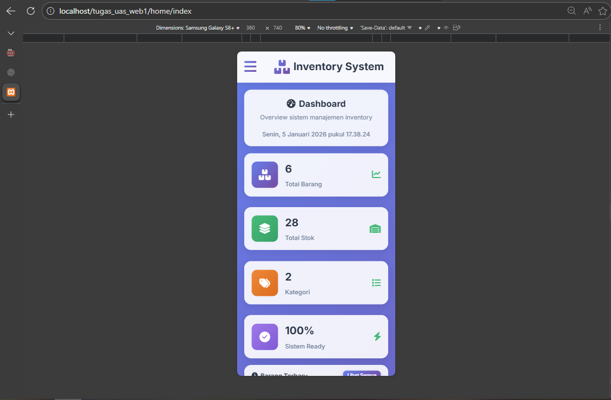

## Pagination 1 dan 2

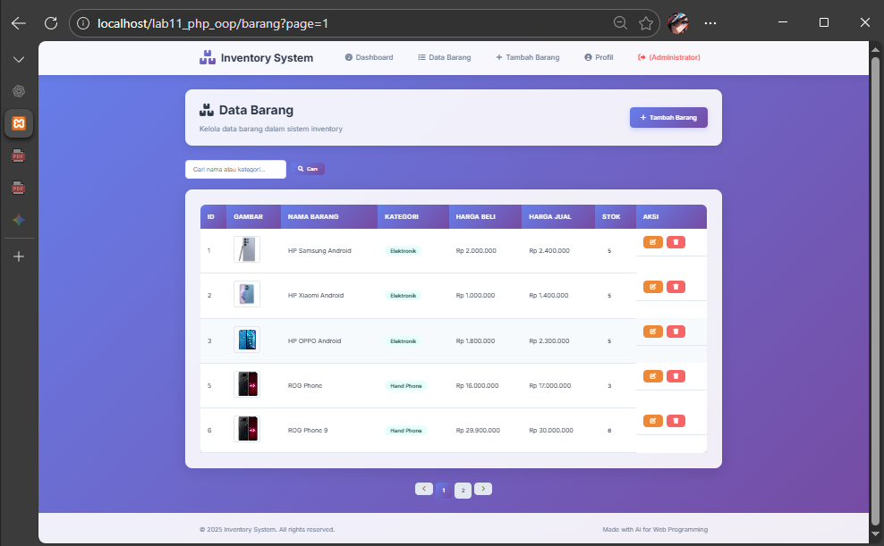   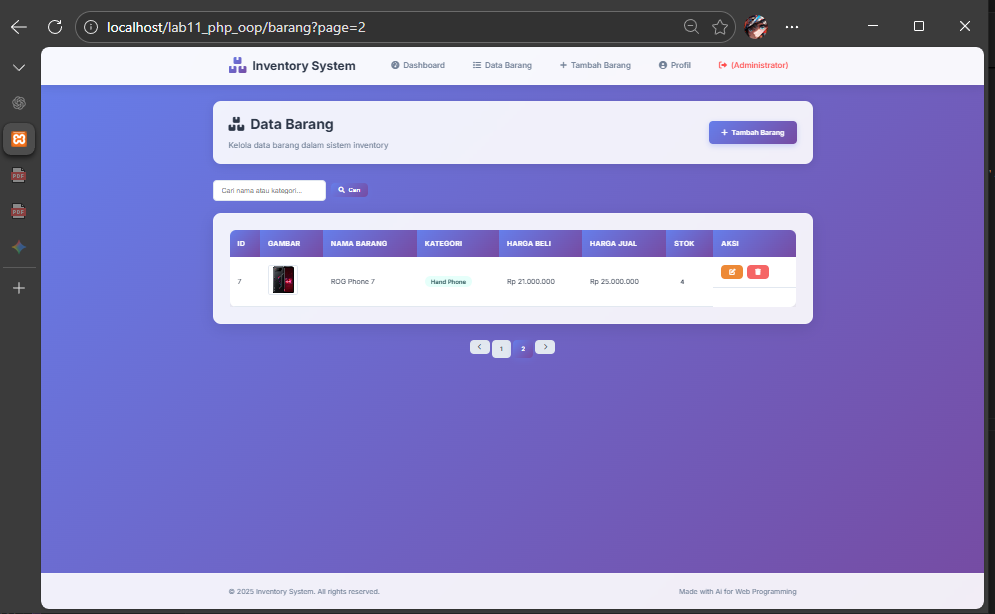


# Lab11Web# tugas_uas_web2
