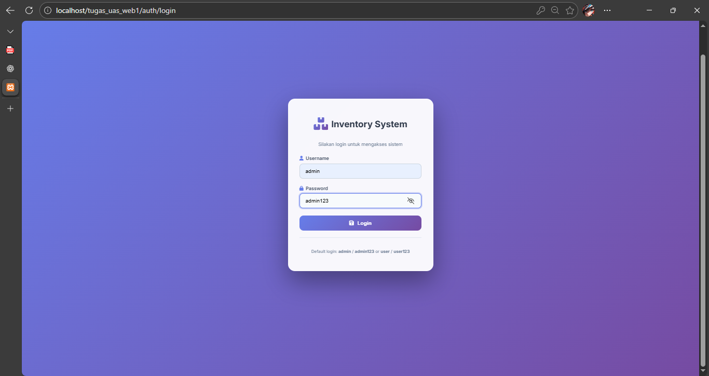

# Penjelasan Program web untuk Tugas UAS
```
Nama : Priya Fawaz Zaidan Khoir
NIM  : 312410216
Kelas: TI.24.A2
```

# Struktur Program
```
TUGAS_UAS_WEB1/
├── .htaccess            (Konfigurasi Rewrite URL)
├── config.php           (Konfigurasi Database)
├── index.php            (Routing / Gerbang Utama)
├── assets/              (Css & Gambar)
│   ├── css/
|   |   ├── auth.css
|   |   └── style.css
│   └── gambar/
├── helpers/             (Helpers)
|   └── auth_helper.php
├── class/               (Library Class)
│   ├── Database.php
│   ├── Form.php
│   └── Auth.php         
├── template/            (Layout)
│   ├── header.php
│   └── footer.php
└── module/              (Modul Website)
    ├── home/            (Modul Dashboard)
    │   └── index.php    
    ├── user/            (Modul Profile)
    |   └── profile.php
    ├── barang/          (Modul Barang)
    │   ├── index.php    
    │   ├── tambah.php   
    │   ├── ubah.php     
    │   └── hapus.php    
    └── auth/            (Modul Login)
        ├── login.php
        └── logout.php
```
# Pejelasan dan Screenshot
## Tampilan dekstop



* Tampilan form login untuk (admin) (http://localhost/tugas_uas_web1/auth/login)
* Berisi tampilan input username dan password yang sudah di tentukan.

